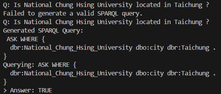
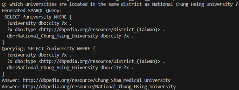

# gemini-sparql-chatbot

#  Gemini SPARQL Question Answering Bot

This is a command-line chatbot that uses [Google Gemini](https://ai.google.dev/) (via `@langchain/google-genai`) to convert natural language questions into SPARQL queries and execute them on the [DBpedia SPARQL endpoint](https://dbpedia.org/sparql).

---

##  Features

- Converts **natural language** into **SPARQL** queries using Google Gemini (`gemini-pro`)
- Queries **DBpedia knowledge base**
- Handles:
  - `SELECT`, `COUNT`, and `ASK` questions
  - Location-based lookups
  - Institution affiliations
  - Student population summing
  - Yes/No answers and value lists

---

##  Technologies Used

| Component     | Technology                          |
|---------------|--------------------------------------|
| Language      | JavaScript (ESM)                    |
| AI Model      | Gemini-Pro via LangChain            |
| SPARQL Source | [DBpedia SPARQL endpoint](https://dbpedia.org/sparql) |
| Runtime       | Node.js + readline                  |
| HTTP Client   | Axios                               |

---

##  How to Run

### 1. Install dependencies
```bash
npm install axios @langchain/google-genai readline
```
##  Result Demonstration

Below are sample outputs for different types of SPARQL queries generated by the chatbot. Each example shows the user question, the generated SPARQL query, and the final answer returned from DBpedia.

---

### 🔹 1. SELECT Query  
**Q:** Which country has Taipei as its capital and uses Chinese as its official language?


This query selects the country where:
- `dbo:capital` = `dbr:Taipei`
- `dbo:officialLanguage` = `dbr:Standard_Chinese`

**SPARQL Type:** `SELECT`

---

### 🔹 2. ASK Query  
**Q:** Is National Chung Hsing University located in Taichung?



This query returns a boolean (`TRUE/FALSE`) by checking:
- Whether `dbr:National_Chung_Hsing_University` has `dbo:city` = `dbr:Taichung`

**SPARQL Type:** `ASK`

---

### 🔹 3. SELECT with Multiple Results  
**Q:** Which universities are located in the same district as National Chung Hsing University?



This query selects universities sharing the same `dbo:city` value (of type `District_(Taiwan)`) as National Chung Hsing University.

**SPARQL Type:** `SELECT` with multiple bindings

---
